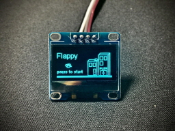
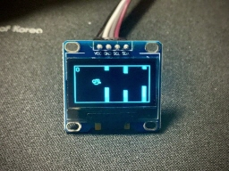

## ESP32 Flappy Bird Game

|  |  |

### Parts
- ESP32
- 128x64 I2C OLED display
- Buzzer
- Push button

### Reference
https://www.hackster.io/arduinob2016/esp32-flappy-bird-game-54391c
https://drive.google.com/open?id=1tLN9o0oKidWqNBs3cleTijr9R8MRRhy0

### Library
https://github.com/ThingPulse/esp8266-oled-ssd1306
