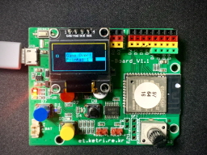
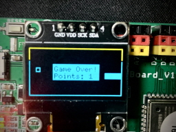

## ESP32 Snake Game
|  |  |

### Parts
- ETboard (ESP32)
- SSD1306 128x64 I2C OLED display
- Push button

### Reference
https://hackaday.io/project/175978-oled-snake-game
https://github.com/vmednis/arduino-snake-game
